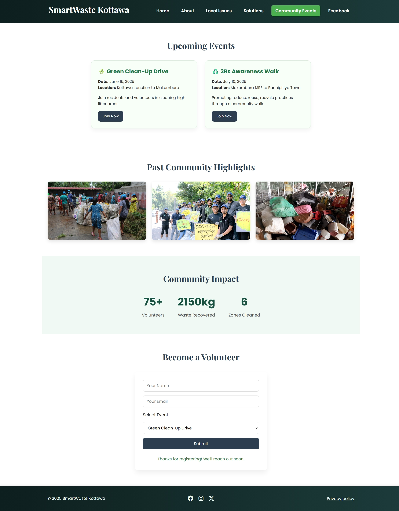

# 🗑️ SmartWaste-Kottawa – A Community-Centered Waste Management Website

SmartWaste-Kottawa is a fully front-end responsive web project created for the **EEI3346 Web Application Development** course at **The Open University of Sri Lanka**. The site is built to tackle real-world waste management problems in Kottawa by raising awareness, collecting community feedback, and promoting local events — all with zero backend.

> 📍 "Built for the community. Powered by clean code."

---

## 📑 Table of Contents

- [Overview](#-overview)
- [Features](#-features)
- [Screenshots](#-screenshots)
- [Live Demo](#live-demo)
- [Tech Stack](#-tech-stack)
- [Setup Instructions](#-setup-instructions)
- [What I Learned](#-what-i-learned)
- [Author](#-author)
- [License](#-license)
- [Acknowledgments](#-acknowledgments)

---

## 🔍 Overview

SmartWaste-Kottawa addresses local issues like illegal dumping and low recycling engagement in the Kottawa area. Designed for speed and simplicity, it features original content and responsive layouts to drive local awareness and digital participation.

This is a **pure front-end** project built with **HTML**, **CSS**, **JavaScript**, and **Vue.js**, following file size constraints and UI/UX guidelines.

---

## ✨ Features

- 🌱 Multi-page layout: Home, Issues, Solutions, Events, Feedback
- 💬 Dynamic feedback and volunteer forms with Vue.js
- 📍 Mockup assistant to find nearby drop-off centers
- 📸 Real, license-free images from Kottawa area
- 📱 Mobile-first, responsive design
- ✨ Stylish Glassmorphism login/register pages

---

## 🖼️ Screenshots

### Register Page


---

### Solutions Page


---

### Events Page


---

## Live Demo

Check out the live project here: [SmartWaste-Kottawa Live Demo](https://smartwaste-kottawa.netlify.app/)

## 🛠️ Tech Stack

### 🔧 Languages & Frameworks

- **HTML5** – Clean semantic markup
- **CSS3** – Flexbox, media queries, variables, animations
- **JavaScript (Vanilla)** – DOM handling, interactivity
- **Vue.js** – Reactive forms and components

### 💡 Libraries & Tools

- **Font Awesome** – Icons and visuals
- **Google Fonts** – Poppins & Playfair Display
- **Swiper.js** – _(optional)_ For sliders

---

## ⚙️ Setup Instructions

### 🚀 How to Run Locally

1. **Clone the repository**

```bash
git clone https://github.com/dulaagamage/SmartWaste-Kottawa.git
```

2. **Navigate into the project folder**

```bash
cd SmartWaste-Kottawa
```

3. **Open index.html in your browser**
   (Or launch it using VS Code Live Server)

```bash
# For VS Code users
code .
# Then right-click index.html > "Open with Live Server"
✅ No build tools needed. Just open it in a browser!
```

### 📚 What I Learned

- Writing clean semantic HTML5 with accessibility in mind
- Crafting responsive layouts with Flexbox and breakpoints
- Using Vue.js to power dynamic forms without backend logic
- Managing performance, file sizes, and load speeds
- Capturing original assets & integrating real-world context
- Organizing code modularly across pages
- Time-boxing tasks and working within constraints

---

### 👩‍💻 Author

- 👩‍🎓 **Name**: H.D.H. Gamage
- 🎓 **University**: The Open University of Sri Lanka
- 📂 **GitHub**: [@dulaagamage](https://github.com/dulaagamage)
- 🔗 **LinkedIn**: [Dulanjalee Gamage](https://www.linkedin.com/in/dulanjalee-gamage-01a7aa207/)
- 📧 **Email**: dulaagamage123@gmail.com

---

### 📝 License

This project was created for academic submission under **OUSL’s EEI3346 Web Application Development** course.

This project is licensed under the [MIT License](LICENSE).  
You are free to use, modify, and distribute this code for non-commercial and educational purposes, provided that proper credit is given to the original author.

### 📜 Acknowledgments

Special thanks to my course instructors and peers for their invaluable feedback and support throughout this project. Your insights helped shape SmartWaste-Kottawa into a better resource for our community.
